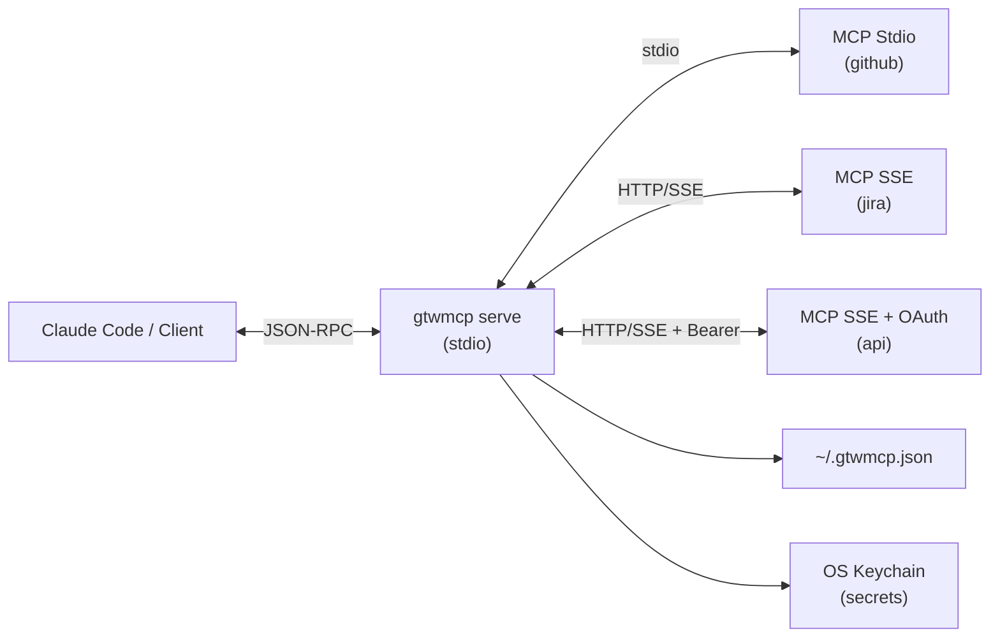
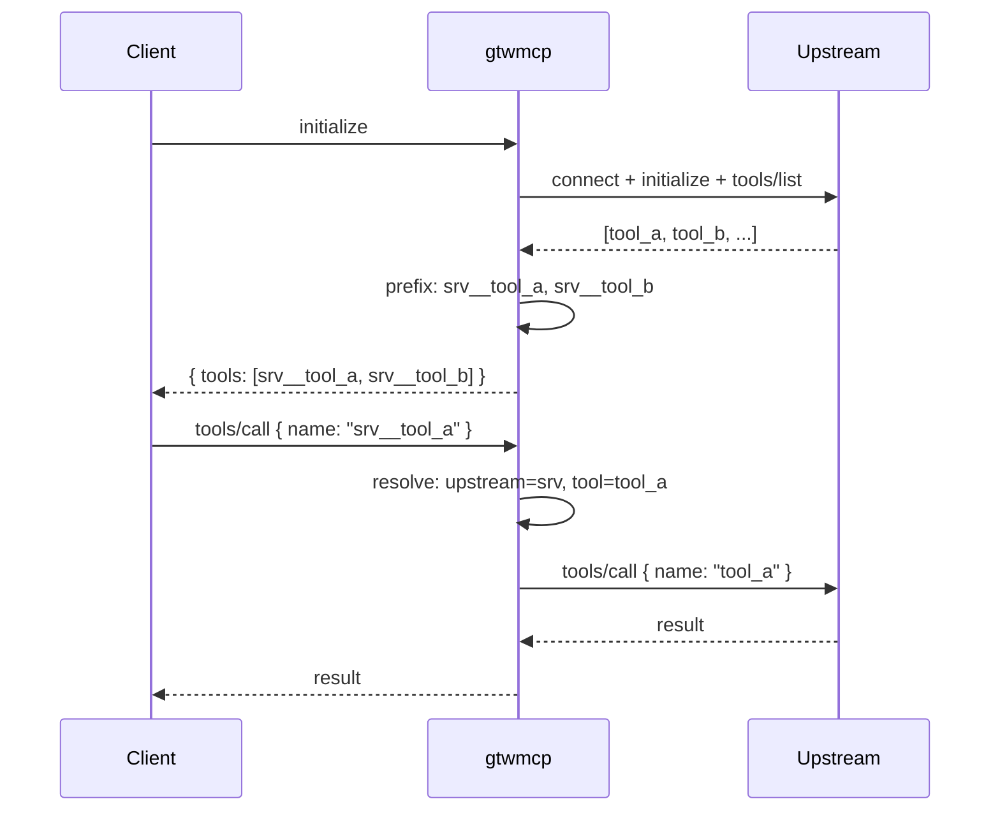
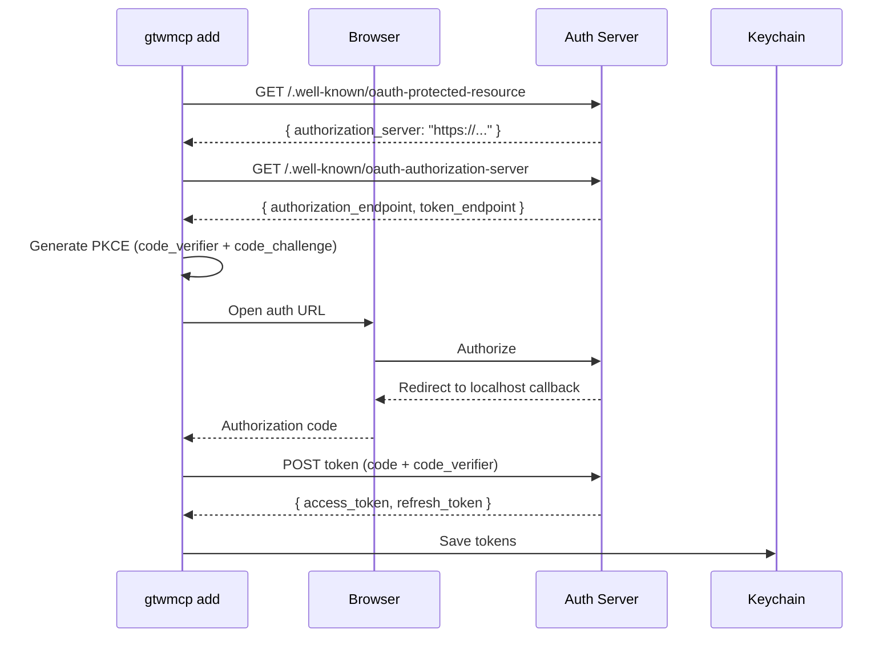

# gtwmcp — MCP Gateway

[](https://github.com/pcandido/gtwmcp/actions/workflows/ci.yml)
[](https://www.npmjs.com/package/gtwmcp)
[](https://nodejs.org)
[](LICENSE)
[](package.json)

Aggregate multiple MCP servers behind a single stdio interface. Supports stdio-based
and HTTP SSE-based upstream MCPs (with OAuth). Configuration in `~/.gtwmcp.json`,
OAuth secrets in the OS keychain.



## Install

```bash
npm install -g gtwmcp
```

Requires Node.js >= 22.

## Quick Start

Add a stdio MCP server:

```bash
$ gtwmcp add github --type stdio --command npx --args "-y,@modelcontextprotocol/server-github" --description "GitHub MCP"
Server "github" added.
```

Add an SSE MCP server with OAuth:

```bash
$ gtwmcp add jira --type sse --url https://mcp.jira.example.com/sse --oauth --description "Jira MCP"
Server "jira" added.
```

List servers:

```bash
$ gtwmcp list
NAME    TYPE   STATUS       DESCRIPTION
------  -----  -----------  -----------
github  stdio  ✅ enabled   GitHub MCP
jira    sse    ✅ enabled   Jira MCP
```

Test a server:

```bash
$ gtwmcp test jira
Connecting to jira (sse) — https://mcp.jira.example.com/sse
Authenticating... OK (token valid, expires in 45m)
Listing tools...
  1. search_jira_issues     Search Jira issues using JQL
  2. get_jira_issue         Get a specific Jira issue
✅ 2 tools available — server is healthy.
```

## CLI Reference

```
gtwmcp add    <name>    Add or update an MCP server
gtwmcp remove <name>    Remove an MCP server
gtwmcp get    <name>    Show a server's configuration
gtwmcp list             List all servers with status
gtwmcp test   <name>    Test connection: authenticate, list tools
gtwmcp enable <name>    Enable a server
gtwmcp disable <name>   Disable a server
gtwmcp serve            Start the MCP gateway in stdio mode
```

## Gateway

The gateway (`gtwmcp serve`) speaks MCP over stdio to the client. On startup it:

1. Reads `~/.gtwmcp.json`
2. Connects to all enabled upstream servers in parallel
3. Calls `initialize` and `tools/list` on each
4. Prefixes every tool with the server name: `<server>__<tool>`
5. Applies allow/block list filters
6. Presents a single consolidated tool list



## Tool Filtering

Control which tools are exposed via environment variables:

| Variable | Behavior |
|---|---|
| `GTWMCP_ALLOW_LIST` | Only matching tools pass |
| `GTWMCP_BLOCK_LIST` | All tools **except** matching pass |
| Both set | Allow first, then block removes from that subset |
| Neither set | All tools pass |

Patterns support trailing `*` wildcard:

```bash
# Expose only read tools
GTWMCP_ALLOW_LIST="github__read_*,github__search_*,github__list_*"

# Expose everything except destructive tools
GTWMCP_BLOCK_LIST="github__delete_*,github__admin_*"
```

## Configuration

`~/.gtwmcp.json`:

```json
{
  "version": 1,
  "servers": {
    "github": {
      "type": "stdio",
      "enabled": true,
      "description": "GitHub MCP server",
      "command": "npx",
      "args": ["-y", "@modelcontextprotocol/server-github"],
      "env": {
        "GITHUB_PERSONAL_ACCESS_TOKEN": "ghp_xxxxxxxxxxxx"
      }
    },
    "jira": {
      "type": "sse",
      "enabled": true,
      "description": "Jira MCP",
      "url": "https://mcp.jira.example.com/sse",
      "headers": {
        "X-Custom-Header": "value"
      },
      "oauth": true
    }
  }
}
```

- **stdio**: `command`, `args`, optional `env` and `description`
- **sse**: `url`, optional `headers`, `oauth`, and `description`
- `"oauth": true` means all OAuth data lives in the OS keychain (never in this file)

## OAuth

The gateway supports Authorization Code Flow with PKCE for SSE servers.



At runtime, `gtwmcp serve` auto-refreshes expired tokens before each call.

### Keychain

| Platform | Backend |
|---|---|
| macOS | `/usr/bin/security` (Keychain) |
| Linux | `secret-tool` (libsecret) |

## Use with Claude Code

Point Claude Code's MCP config at the gateway:

```json
{
  "mcpServers": {
    "gtwmcp": {
      "type": "stdio",
      "command": "npx",
      "args": ["-y", "gtwmcp", "serve"]
    }
  }
}
```

All your upstream MCP tools appear prefixed and unified in Claude Code.

## Development

```bash
npm install
npm run check   # syntax validation
npm test        # 57 tests
```

Zero external dependencies. Node.js 22+ stdlib only.
